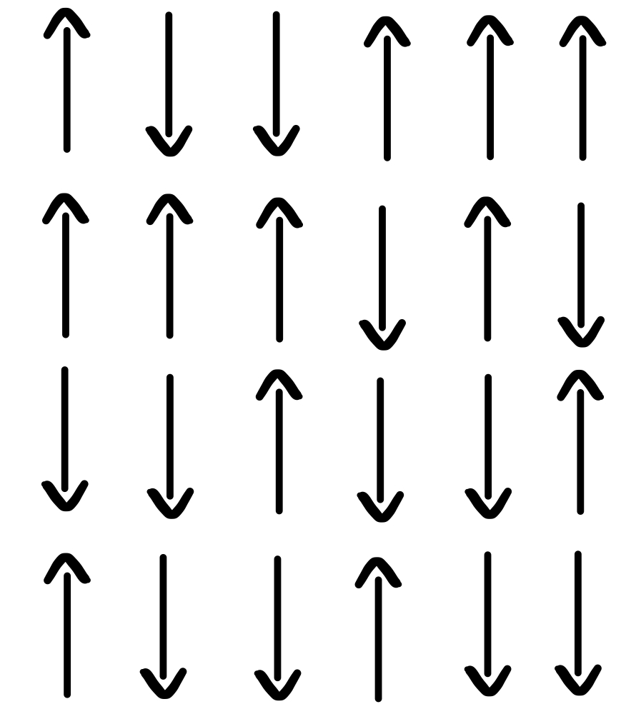

# Monte-Carlo-Ising-Model
The Ising model is a cornerstone of statistical mechanics, providing a simple yet powerful framework to study phase transitions in systems with many interacting components. This repository guides you through Monte Carlo methods and their application to the Ising model. You can find the full code [here](https://github.com/JachinTekle/Monte Carlo Ising Model)

## Markov-Chain Monte Carlo (MCMC)

Monte Carlo methods are a class of computational algorithms that rely on random sampling to approximate numerical results. Named after the famous Monte Carlo Casino, these techniques are widely used in statistics, physics, finance, and machine learning.

### Markov Chains
To better understand Markov chains, let's look at a simple example from financial mathematics:


The graph shows a "random walk" - a random path where each next step depends only on the current state (Markov property). This is a fundamental characteristic of Markov chains: The future depends only on the present state, not on the past.


This visualization illustrates how transition probabilities evolve over time in a Markov process. As time progresses, the distribution becomes wider, indicating increasing uncertainty about the system's future state—even though all paths originated from the same initial condition.

### Key Properties of Markov Chains:
1. **Memorylessness**: The next state depends only on the current state
2. **Stationarity**: The transition probabilities remain constant over time
3. **Ergodicity**: The system can reach any state from any other state

## 2D Ising Model

In classical statistical mechanics, we study the behavior of systems with many interacting components. The Ising model is a simple yet powerful model used to understand phase transitions, such as the transition between magnetized and non-magnetized states in ferromagnetic materials. 

In most ordinary materials, the associated magnetic dipoles of the atoms have random orientations. As a result, there is no overall macroscopic magnetic moment. However, in certain materials such as iron, a magnetic moment emerges due to a preferred alignment of the atomic spins.

This phenomenon, known as spontaneous magnetization, arises from interactions between neighboring spins that tend to align them in the same direction. The Ising model provides a simple theoretical framework to study this behavior. 

The Ising model consists of N systems ('spins') $\boldsymbol\sigma=(\sigma_1,...,\sigma_N)$ located on a lattice, where each spin $\sigma_i \in \{\pm1\}$ can be either up (+1) or down (–1).

Considering no external magnetic field and constant coupling between the spins, the energy of the system is given by the following Hamiltonian:
$$
\mathcal{H}(\boldsymbol\sigma)=- J\sum_{\langle i,j \rangle} \sigma_i \sigma_j
$$
- $\sum_{\langle i,j \rangle} \sigma_i \sigma_j$ being the sum over all neighboring spins
- $J$ being the coupling constant between the spins



By studying the Ising model, especially in two dimensions, one can gain insight into phase transitions and critical phenomena, such as the abrupt loss of magnetization at a certain critical temperature.

### The Partition Function

A central concept in statistical mechanics is the **partition function**, which encodes all thermodynamic information about a system. For the Ising model, the partition function $Z$ is defined as:
$$
Z = \sum_{\mu} e^{-\beta \mathcal{H}_\mu}
$$
where:
- $\mu$ denotes the set of all possible spin configurations
- $\beta = 1/(k_B T)$, with $k_B$ being the Boltzmann constant and $T$ the temperature

The probability of finding the system in configuration $\mu$ is:
$$
P(\mu)=\frac{e^{-\beta\mathcal{H}_\mu}}{Z} 
$$

Computing $Z$ numerically is challenging because the sum runs over all $2^{N^2}$ possible spin configurations for an $N \times N$ lattice. This exponential growth makes direct calculation infeasible for all but the smallest systems.

### The Metropolis Algorithm

The Metropolis algorithm allows us to sample configurations according to the Boltzmann distribution without calculating $Z$. 
The **Detailed Balance** condition must hold:

$$p_\mu P(\mu \to \nu) =p_\nu P(\nu \to \mu)$$

Therefore:
$$
\frac{P(\mu \to \nu)}{P(\nu \to \mu)} = \frac{P(\nu)}{P(\mu)} = \frac{e^{-\beta\mathcal{H}_\nu}}{e^{-\beta\mathcal{H}_\mu}}= e^{-\beta\Delta E}
$$

**Metropolis-Hastings Algorithm Steps**:

1. Initialize lattice configuration $\mu$ 
2. Create a new configuration $\nu$ by flipping a random spin  
3. Calculate $\Delta E$ of the configuration
4. - If $\Delta E > 1$: accept $\nu$
   - else: accept $\mu$ with propability $e^{-\beta\Delta E}$ 

```python
def metropolis_step(lattice, T):
    N = lattice.shape[0]
    # Generate all random numbers 
    random_indices = np.random.randint(0, N, size=(N * N, 2))
    random_probs = np.random.rand(N * N)
    
    for idx in range(N * N):
        i, j = random_indices[idx]
        S = lattice[i, j]
        neighbors = (lattice[(i + 1) % N, j] + lattice[i, (j + 1) % N] +
                     lattice[i - 1, j] + lattice[i, j - 1])
        dE = 2 * S * neighbors  # Energy change if spin is flipped
        
        # Accept flip if energy decreases or with probability exp(-dE/T)
        if dE < 0 or random_probs[idx] < np.exp(-dE / T):
            lattice[i, j] *= -1
    
    return lattice
```


